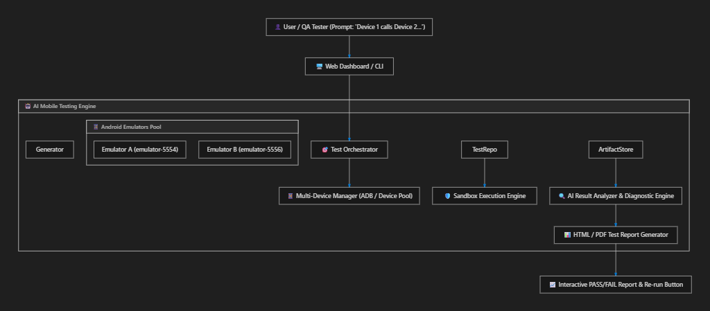

# AI-Powered Multi-Device Mobile Testing Agent 📱🤖

An autonomous, multi-device Android test automation platform powered by Generative AI. 

Author end-to-end multi-device mobile tests in plain English (e.g., *"Device A calls Device B, Device B answers, wait 5 seconds, hang up"*), automatically generate deterministic Python test scripts, execute them in an isolated sandbox, collect visual and log artifacts, diagnose failures using AI, and save the generated test suite for re-execution in CI/CD pipelines.

---

## 🌟 Key Features

1. **Natural Language Test Authoring**: Describe complex multi-device user journeys in plain English.
2. **Multi-Device Orchestration**: Manages multiple physical devices or Android emulators (`emulator-5554`, `emulator-5556`) seamlessly.
3. **Deterministic Code Generation**: Generates clean, robust Python test code using standard assertions and synchronization primitives.
4. **Test Reusability & Persistence**: All generated tests are saved to `tests/generated/` and can be re-executed at any time without calling the LLM again.
5. **Isolated Sandbox Execution**: Runs tests in a controlled harness with step timers, timeout safeguards, and logcat capturing.
6. **Visual & System Artifact Collection**: Captures before/after step screenshots, system logs, and UI hierarchy XML.
7. **AI Failure Diagnostics & HTML Reporting**: Automatically diagnoses failures and generates standalone interactive `report.html` dashboards.
8. **Dual Execution Engine (Live / Simulated)**: Works with real Android emulators/devices over ADB, with a high-fidelity sandbox fallback simulator for development and demos.

---

## 🏗️ Architecture



```text
User Prompt ("Device A calls Device B...")
                  │
                  ▼
         [ ScriptGenerator ] (Gemini API / AST Verification)
                  │
                  ▼
         [ Saved Test File ] (tests/generated/test_xyz.py)
                  │
                  ▼
         [ SandboxRunner ]  <───> [ DeviceManager ]
         (Isolated Run)             │
           │                        ├──> Emulator A (emulator-5554)
           │                        └──> Emulator B (emulator-5556)
           ▼
     [ Artifacts Store ] (Screenshots, Logcat, Summary JSON)
           │
           ▼
     [ ResultAnalyzer ] ───> [ report.html + AI Root Cause Analysis ]
```

---

## 🚀 Quick Start

### 1. Installation

```bash
# Clone or navigate to the repository
cd c:\AI-Mobile-Testing-Agent

# Install required Python dependencies
pip install -r requirements.txt
```

### 2. Configure Environment (Optional)

Create a `.env` file in the root directory:

```ini
GEMINI_API_KEY=your_gemini_api_key_here
GEMINI_MODEL=gemini-2.5-flash
DEFAULT_COMMAND_TIMEOUT=60
```

*(Note: The system includes a smart synthesis engine, so tests will generate and run even if no API key is provided!)*

---

## 💻 Usage

### 🌐 Option A: Launch Interactive Web Dashboard

```bash
python cli.py web
# OR: streamlit run web/app.py
```
Open `http://localhost:8501` to:
* View connected devices and AVDs.
* Author test scenarios and watch live step-by-step executions.
* Rerun saved test suites with one click.
* Inspect screenshots and download HTML test reports.

---

### ⌨️ Option B: Command-Line Interface (CLI)

#### 1. Check Connected Devices & Emulators:
```bash
python cli.py devices
```

#### 2. Generate a Test Script from Plain English:
```bash
python cli.py generate "Device A calls Device B (555-0002), Device B answers, stay on line 5s, Device A hangs up" --name test_call_flow
```

#### 3. Generate & Execute in One Step:
```bash
python cli.py generate "Device A sends SMS 'Hello' to Device B, Device B verifies receipt" --execute
```

#### 4. Re-run an Existing Saved Test (No LLM token cost):
```bash
python cli.py run tests/generated/test_call_flow.py
```

#### 5. List All Saved Reusable Test Scripts:
```bash
python cli.py list-tests
```

---

## 📁 Project Structure

```text
AI-Mobile-Testing-Agent/
├── core/
│   ├── device_manager.py      # ADB device discovery & serial management
│   ├── script_generator.py    # LLM test code generation & AST validator
│   ├── sandbox_runner.py      # Isolated test runner & step recorder
│   └── result_analyzer.py     # AI failure diagnostics & HTML reporter
│
├── framework/                 # Automation SDK imported by generated tests
│   ├── device_session.py      # High-level actions (dial, SMS, tap, screenshot)
│   ├── multi_device_harness.py# Multi-device test fixture & step decorator
│   └── synchronization.py     # Synchronization barriers
│
├── tests/
│   ├── generated/             # 💾 Persisted reusable test scripts
│   └── templates/             # Prompt engineering few-shot templates
│
├── artifacts/                 # Test run outputs (runs/run_YYYYMMDD_HHMMSS/...)
│   └── run_*/
│       ├── screenshots/       # Step screenshots
│       ├── summary.json       # Metadata & metrics
│       └── report.html        # Interactive HTML report
│
├── web/
│   └── app.py                 # Streamlit web dashboard
│
├── config.py                  # Auto-discovery of ADB and environment settings
├── cli.py                     # CLI entrypoint
├── requirements.txt           # Dependencies
└── README.md                  # Documentation
```
